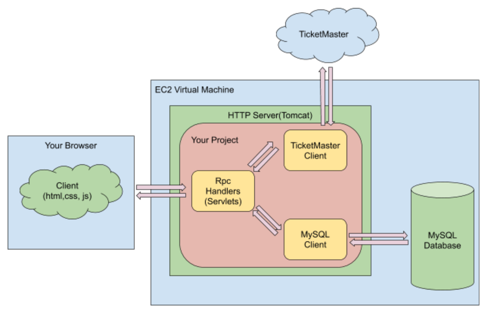
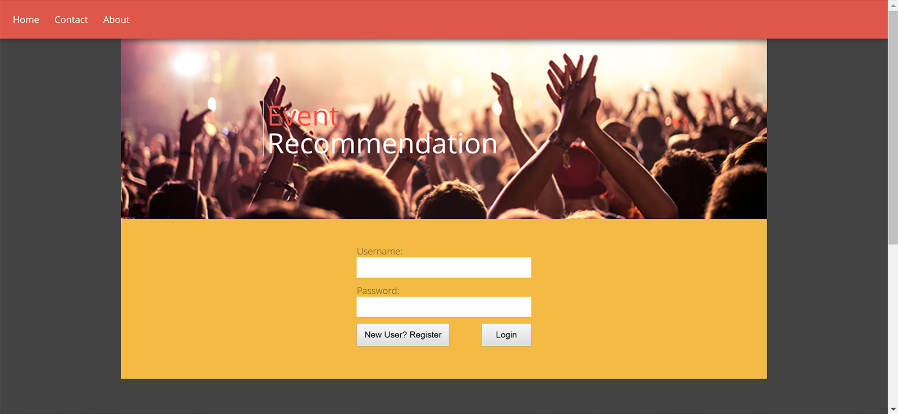
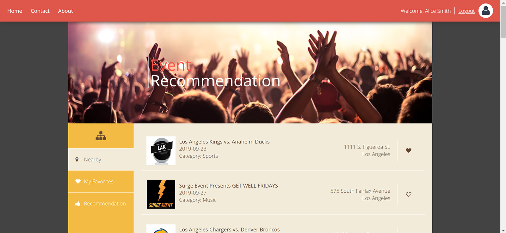

# EventGrab: Full-stack Java web service development
 
 ## Overview
This project builds a full-stack Java web service that provides event search and personalized recommendation for users. The interactive frontend web page is developed using html, CSS and JavaScipt, and the backend server implements several Java Servlets in Apache Tomcat to handle different business logics. Functionalities supported are account registering, event searching based on date and geo-location, user favorite history tracking and event recommendation based on user favorite history. Event data are provided by TicketMaster via [TicketMaster Discovery API](https://developer.ticketmaster.com/products-and-docs/apis/discovery-api/v2/). User data are stored and managed using relational and NoSQL databases. 

|  |
:-------------------------:
| <em>Project diagram</em> |

## Source Code
The source code is in [`eventgrab`](eventgrab).
* [`src`](eventgrab/src) - backend server (can be deployed onto Amazon EC2 or other cloud platforms)
    - [`db`](eventgrab/src/db) - classes that handle database connection
    - [`external`](eventgrab/src/externel) - classes that parse TicketMaster API responses
    - [`recommendation`](eventgrab/src/recommendation) - classes that implement business recommendation
    - [`rpc`](eventgrab/src/rpc) - Servlets and helper classes that handle remote procedure calls (HTTP requests and responses)
* [`WebContent`](eventgrab/WebContent) - frontend web contents

## Usage
The source code in [`db`](eventgrab/src/db) implements connection with two types of databases: relational (MySQL) and NoSQL (MongoDB). You can choose to use either by setting the private field `DEFAULT_DB` in `db.DBConnectionFactory`.
* Choosing MySQL: 
``` Java 
private static final String DEFAULT_DB = "mysql"; 
```
* Choosing MongoDB: 
``` Java 
private static final String DEFAULT_DB = "mongodb"; 
```

To use the TicketMaster APIs, you will need to register an account at [https://developer.ticketmaster.com/](https://developer.ticketmaster.com/). Substitue the field `API_KEY` in `external.TicketMasterClient` with your own API key:
```Java
private static final String API_KEY = "YOUR_TICKETMASTER_API_KEY";
```

## Demo
|  |
:-------------------------:
| <em>Login page</em> |
|  |
| <em>Main page</em> |
